# Certificate-deployment workflow main chain

## Main chain

Certificate deployment is an auditable orchestration chain, not a single plugin call:

```mermaid
flowchart LR
  A["Certificate asset and version"] --> B["Artifact Contract"]
  B --> C["Asset Context + Binding"]
  C --> D["Unified input resolution"]
  D --> E["preflight"]
  E --> F["Fixed snapshot and hash"]
  F --> G["Plan submission and approval"]
  G --> H["Dry-run"]
  H --> I["execute"]
  I --> J["VERIFY"]
  J --> K["Result sync and audit"]
  I --> L["Failure"]
  L --> M["Declared rollback"]
  M --> J
```

## Certificate versions and Artifacts

Do not write certificate PEM, private keys, or PFX passwords into workflow DSL. Declare Artifact slots and output roles such as leaf certificate, private key, ordered chain, PFX/PKCS#12 package, and target certificate SHA-256 fingerprint.

The plan fixes the certificate version and `certificateFormatId`. `EXPLICIT` uses the selected version. `LATEST_AUTO` resolves from the selected certificate-asset seed only when the plan is created; execution and retry do not select a new current version.

## Target and execution source

Respect the four target modes:

| Mode | Workflow relationship |
| --- | --- |
| Agentless `DeviceAsset` | Uses standard target facts and an agentless connection without inventing an Agent PluginBinding |
| `ManagedTarget + Plugin` | Uses a CapabilityAssignment, PluginBinding, and fixed PluginVersion for atomic capability |
| `ManagedTarget + Workflow Override` | Uses the explicitly selected WorkflowExecutionBinding |
| `Standalone + Workflow` | Uses an ApplicationAsset and WorkflowExecutionBinding without a new Standalone PluginBinding |

A DeploymentPlanTarget has exactly one `ResolvedExecutionSource`. Plugin and workflow arguments must not be mixed; execution location does not select the implementation.

## Preflight, execution, and rollback

Preflight checks the target, tenant, permissions, capability, execution location, certificate version, format, Artifact Contract, asset context, Credential version, workflow/plugin version, input hashes, Gateway, locks, rollback, and verification conditions.

After preflight, the host stores a redacted `DeploymentInputSnapshotV1` and runtime snapshot reference. Dry-run checks feasibility without advancing formal asset state. Execute uses the fixed snapshot and execution identity. The `verify` stage must check the certificate fingerprint returned by the real target service or TLS endpoint; local upload success is not enough.

On failure, execute only the rollback branch declared by the WorkflowVersion. A rollback failure preserves both failure records and enters manual handling. Result synchronization updates the current certificate binding only after formal verification or successful rollback.

## Plugin-internal and derived workflows

Publishing a `WORKFLOW_DSL` plugin creates a read-only `plugin_internal` WorkflowVersion. Copying it creates a user-owned version with complete Provenance. Plugin upgrades do not rewrite user workflows; applying a new version is explicit and requires new preflight.

`AGENT_ATOMIC` plugins use signed Atomic Plans and cannot become workflow Steps. User-plugin publisher cryptographic verification, real vendor deployment/rollback, Gateway, and product-version acceptance remain `TODO` or `in_review` according to the capability.
