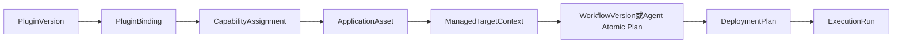

# 核心对象与主链

GCAC 不把每个厂商做成宿主代码中的独立产品分支。插件声明能力，宿主解析目标、权限、凭据、证书制品和执行位置。

## 关键原则

1. 插件身份由 `CapabilityAssignment -> PluginBinding -> PluginVersion` 解析。
2. 执行位置描述在哪里执行，不决定使用哪个插件。
3. 计划固定部署输入快照，执行时不能偷偷回查当前配置。
4. 证书材料通过统一 Artifact，不在普通日志或快照中保存明文私钥。
