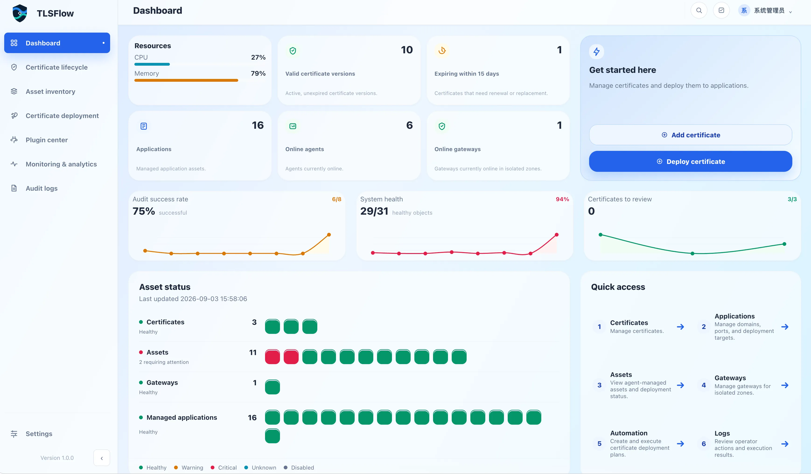
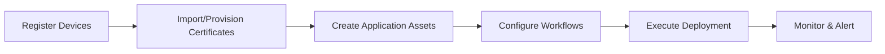

# TLSFlow v1.0.0 Documentation

Welcome to TLSFlow! An enterprise-grade certificate lifecycle management platform that unifies certificate provisioning, deployment, renewal, and monitoring — transforming manual operations into automated workflows and reactive troubleshooting into proactive monitoring.

---

## Core Capabilities

**🔐 Certificate Automation**  
Automatically provision certificates from Let's Encrypt, ZeroSSL, and other CAs with unified storage, renewal, and version management

**🔄 Visual Workflows**  
Drag-and-drop deployment flows supporting SSH execution, HTTP API calls, conditional branching, and exception handling

**🔌 Plugin Extensibility**  
Built-in plugins for Nginx, Apache, Tomcat, IIS with support for custom platform adapters

**📊 Monitoring & Audit**  
Automatic expiration alerts, full operation audit trails, and one-click rollback

---

## Documentation Navigation

### 📦 [Installation](/v1.0.0/en/installation/)

Deploy TLSFlow from scratch — choose the deployment model that fits your needs:

- **[Quick Start](/v1.0.0/en/installation/quick-start)** - 5-minute hands-on experience
- **[Standard Deployment](/v1.0.0/en/installation/standard-deployment)** - Frontend/backend separation + PostgreSQL for production environments
- **[Single-Node Deployment](/v1.0.0/en/installation/single-node-deployment)** - One-command Docker Compose launch for testing
- **[Deployment Parameters](/v1.0.0/en/installation/deployment-parameters)** - Environment variables and configuration reference
- **[First Login](/v1.0.0/en/installation/first-login)** - Complete initial setup

### 📚 [User Manual](/v1.0.0/en/manual/)

Comprehensive operational guides organized by console menu structure, covering the full lifecycle from certificate provisioning to deployment execution:

**Core Modules**
- **[Dashboard](/v1.0.0/en/manual/dashboard)** - Certificate status overview and quick action entry
- **[Certificate Management](/v1.0.0/en/manual/certificate-management)** - Certificate assets, ACME automation, CA configuration
- **[Asset Center](/v1.0.0/en/manual/asset-center)** - Application assets, devices, cloud accounts, Gateway
- **[Certificate Deployment](/v1.0.0/en/manual/certificate-deployment)** - Workflow configuration, automated execution, execution records
- **[Plugin Center](/v1.0.0/en/manual/plugin-center)** - Plugin installation, configuration, and management

**Operations Management**
- **[Monitoring and Analysis](/v1.0.0/en/manual/monitoring)** - Certificate expiration monitoring, deployment success rates, reports
- **[Audit Logs](/v1.0.0/en/manual/audit-logs)** - Operation records, compliance audit trails
- **[System Settings](/v1.0.0/en/manual/system-settings)** - Users, roles, credentials, notifications, licenses

**Advanced Topics**
- **[Tenant and RBAC](/v1.0.0/en/manual/tenant-and-rbac)** - Multi-tenant isolation and permission control
- **[Agent](/v1.0.0/en/manual/Agent)** - Remote execution agent configuration
- **[Backup and Restore](/v1.0.0/en/manual/backup-and-restore)** - Data backup strategies
- **[Upgrade and Rollback](/v1.0.0/en/manual/upgrade-and-rollback)** - Version upgrade guide
- **[Troubleshooting](/v1.0.0/en/manual/troubleshooting)** - Common issue diagnostics
- **[Security Considerations](/v1.0.0/en/manual/security-considerations)** - Security hardening recommendations

### 🛠️ [Developer Documentation](/v1.0.0/en/developer/)

Extend TLSFlow functionality by developing custom plugins and workflows:

- **[Host Plugin Capabilities](/v1.0.0/en/developer/host-plugin-capabilities)** - Platform-provided plugin development interfaces
- **[Plugin Development](/v1.0.0/en/developer/plugin-development)** - Plugin development specifications and best practices
- **[Plugin Example: Nginx Proxy Manager](/v1.0.0/en/developer/plugin-example-nginx-proxy-manager)** - Complete plugin development case study
- **[Workflow Development](/v1.0.0/en/developer/workflow-development)** - Workflow template development guide

---

## Quick Start

### Typical Usage Flow

### 5-Minute Quick Experience

1. **Deploy** - Run single-node deployment to launch TLSFlow with one command
2. **First Login** - Access the console and complete initialization
3. **Follow Guide** - Click "Quick Start" on the dashboard and complete your first certificate deployment via the wizard

→ [View detailed quick start guide](/v1.0.0/en/installation/quick-start)

---

## Other Languages

- 🇨🇳 [简体中文文档](/v1.0.0/)

---

## Technical Support

Need help or have questions?

- 📖 **Documentation Search** - Use the search box in the top navigation
- 📧 **Email Support** - support@tlsflow.com
- 🐛 **Issue Reporting** - [GitHub Issues](https://github.com/your-org/tlsflow/issues)

---

**Current Version**: TLSFlow v1.0.0 | **Documentation Updated**: 2026-09-02

Documentation content follows current specifications, code, and verification evidence.

