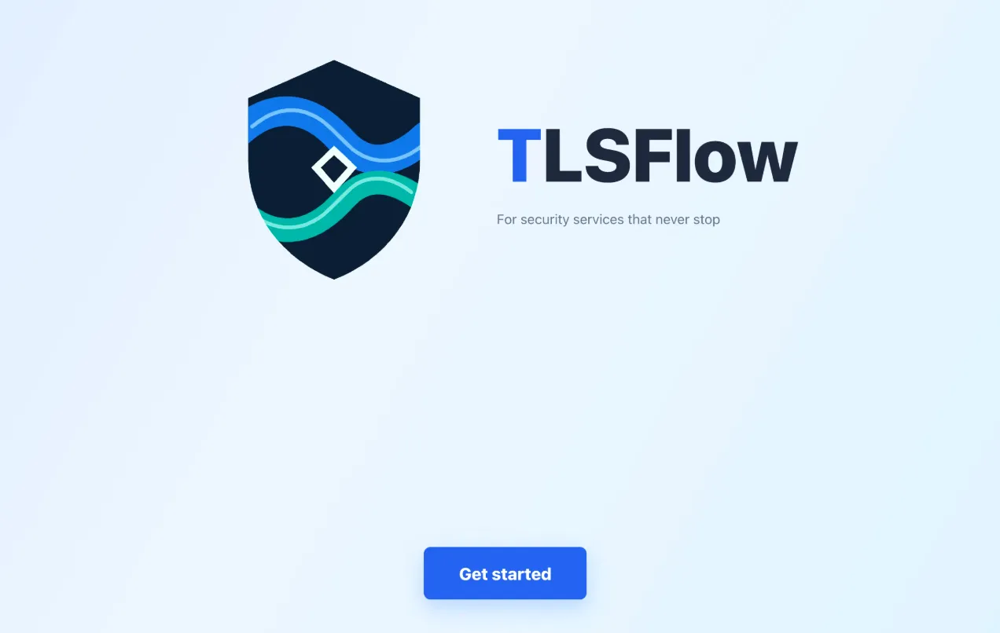
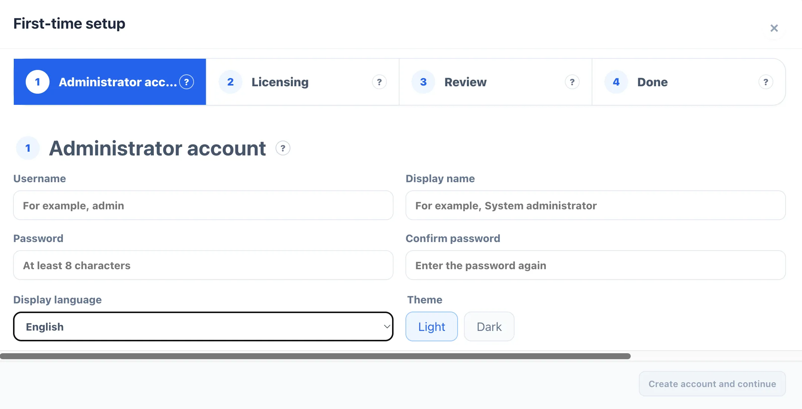

# First Login

After deployment, the first visit to the console opens the **First-time setup** wizard. Follow the screens in order. You do not need to create a database user first, and new deployments do not need `GCAC_INITIAL_ADMIN_PASSWORD`.

This page describes the first use of a new instance. If you see the regular login page immediately, the instance has already been initialized; sign in with an existing account.

## Open the Console

- Standard deployment: open `http://<host-address>:<GCAC_PORT>/`; the default port is `8085`.
- Single-node deployment: open `http://<host-address>:8085/`. If you changed the host port with `docker run -p`, use the actual mapped port.

Make sure the containers are running and the Web page is reachable. On a new instance, the application redirects you to initialization automatically; you do not need to construct an initialization URL yourself.

## Complete the Initial Setup Wizard

### 1. Start setup

The page first shows a short brand intro animation. When it finishes, click **Get started** to enter the wizard. If reduced motion is enabled in the system or browser, the animation may be skipped; the setup steps are unchanged.

### 2. Create the administrator account

On **Administrator account**, enter:

- **Username**: the name you will use to sign in. Choose one that is easy to recognize and will not be confused with another account. It must be 2 to 64 characters, start with a letter or number, and contain only letters, numbers, dots, underscores, or hyphens.
- **Display Name**: the name shown in the console, such as `System Administrator`.
- **Password** and **Confirm Password**: the password must be at least 8 characters, and both entries must match.
- **Display language** and **Theme**: choose the language and light or dark theme you prefer. You can adjust these later in the system preferences.

Click **Create account and continue**. After the account is created, the system records the initialization state and establishes a temporary session before moving to the next step. The password is cleared and is never shown on the confirmation page.

### 3. Configure product licensing (optional)

If you do not have a license file yet, click **Set up later**. This does not prevent initialization; you can add the license later from the **Licensing** page.

To complete offline licensing during setup:

1. Click **Export Request File**, save the downloaded JSON file, and send it to the supplier as instructed.
2. When you receive the activation response, click **Import license file** to choose the JSON file, or paste the complete content into **License content**.
3. Click **Import license** and wait for the **Your license is active** confirmation before continuing.

The request and response files are a pair. Keep the original files. If import fails, first check that the content was not truncated or reformatted and that the response belongs to this instance.

### 4. Review and finish

The **Review** page shows the username, display language, and theme for a final check. The password is not displayed.

This page also reminds you to protect `GCAC_SECRET_KEK`. It is the root key used to decrypt sensitive system data. Store it offline, and never put it in source code, logs, screenshots, or chat messages. If it is lost, historical Secret data cannot be recovered; do not replace it casually after initialization.

When everything is correct, click **Finish setup**. After **Setup complete** appears, click **Go to sign in**.

## Sign in with the New Account

On the login page, enter the username and password you just created, then click the sign-in button. Returning to the login page at the end of the wizard is expected: it lets you verify that the new account can sign in normally.

After signing in, a sensible first pass is:

1. Create separate daily-use accounts in user and role settings; reserve the administrator account for administrative work.
2. Add the credentials required for device or service connections under **System Settings → Credentials**.
3. Onboard one test target in the Asset Center, then perform a small-scale test deployment with a test certificate and check the execution record and target read-back.

## Common Issues

### The initialization page does not move forward

Confirm that Backend and the database are ready, then refresh the page. If account creation fails, the wizard returns to a retryable state and does not leave a partial administrator account behind.

### “The passwords do not match”

Enter the password and confirmation again, making sure that neither value contains unintended leading or trailing spaces.

### License import fails

Make sure you exported the request file from this instance before importing the supplier's complete JSON response. Licensing can also be completed later from the **Licensing** page, so you can finish initialization without repeatedly retrying the import.

### The `GCAC_SECRET_KEK` value is missing

Do not replace the environment variable in an attempt to recover the data. This key decrypts historical Secrets. If it is lost, follow your organization's key recovery procedure and retrieve the original value from the approved password manager or offline storage.

## Important Post-Initialization Task: Import the Product License

After initialization, import a product license before normal use. If the console shows **No valid product license detected**, open **System Settings → Licensing** and complete the authorization process. Export the request file from this instance, register or sign in at the [TLSFlow User Center](https://license.tlsflow.com), generate a Community license, download it or send it to your email, and then import the complete JSON file in the Licensing page. Do not edit the request or license file; they are bound to this installation.
