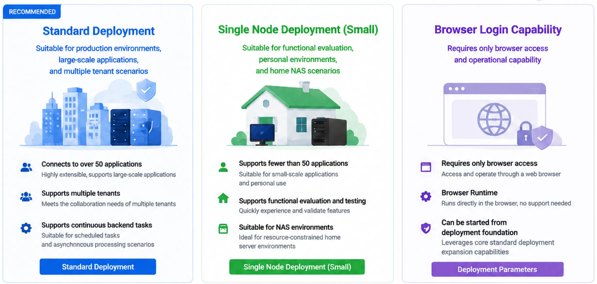

<h1>Installation</h1>

This page helps you complete your first TLSFlow v1.0.0 deployment. TLSFlow provides two Docker deployment options:

<ul>
  <li><strong>Standard deployment</strong> is intended for production. It runs several services with Docker Compose and uses PostgreSQL for business data.</li>
  <li><strong>Single-node deployment (small)</strong> is intended for evaluation, small environments, or home NAS use. It runs one Docker container with a built-in file-based database.</li>
</ul>

Both options use prebuilt images from Docker Hub. The host does not need Node.js, Go, or the TLSFlow source code.

## Choose a Deployment Method

| If your situation is | Recommended option | What you need | Detailed guide |
| --- | --- | --- | --- |
| Production use, 50 or more application assets, multiple tenants, or continuous background tasks | **Standard deployment** | Docker Compose v2, persistent storage, PostgreSQL settings, and platform secrets | [Standard Deployment](./standard-deployment.md) |
| Evaluation, personal use, home NAS, or fewer than 50 application assets | **Single-node deployment (small)** | Docker CLI, persistent storage, and platform secrets | [Single-node Deployment](./single-node-deployment.md) |
| Browser-based login is required | **Standard deployment** | Enable Browser Runtime (the browser runtime service) on demand | [Deployment Parameters](./deployment-parameters.md) |

> **Important:** Standard and small deployments cannot run at the same time. Before switching, stop the existing containers and make sure that no container still uses port `8085` or the same data directories.

## Recommended Installation Sequence

Use this sequence for either deployment option:

1. Read [Quick Start](./quick-start.md) to confirm host requirements, image sources, and required secrets.
2. Open [Standard Deployment](./standard-deployment.md) or [Single-node Deployment](./single-node-deployment.md) and start the selected deployment.
3. Use [Deployment Parameters](./deployment-parameters.md) to review environment variables. Secret values must remain unchanged after first initialization.
4. Open [First Login](./first-login.md), create the administrator account, and complete the security initialization.
5. After signing in, confirm the license status (if a license is provided), create daily-use accounts, store credentials, connect a test device, import a test certificate, and run a Dry Run (read-only rehearsal).

This order separates the checks into clear stages: host and container health, account and permission setup, target connectivity, and actual certificate deployment.

## Confirm the Installation

- Containers are `running`, database migrations have completed, and the Web console opens successfully.
- An administrator account exists, daily work uses separate accounts, and permissions follow least privilege.
- Production deployments have persistent storage and backups for the database, workflows, and runtime security materials.
- A test device passes connection and read-only discovery, and a test certificate completes a Dry Run.
- Treat execution records, target read-back, monitoring, and audit logs as the final evidence. A successful form submission does not prove that a certificate was deployed.

## Related Documentation

- [Quick Start](./quick-start.md): the shortest path from preparation to a running container.
- [Deployment Parameters](./deployment-parameters.md): complete reference for environment variables, secrets, and data directories.
- [First Login](./first-login.md): create the administrator account and complete the initial security setup.
