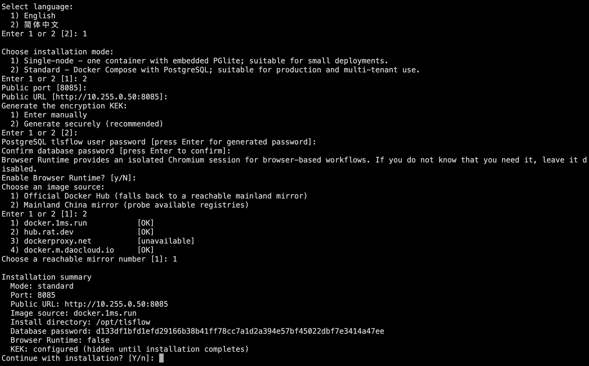
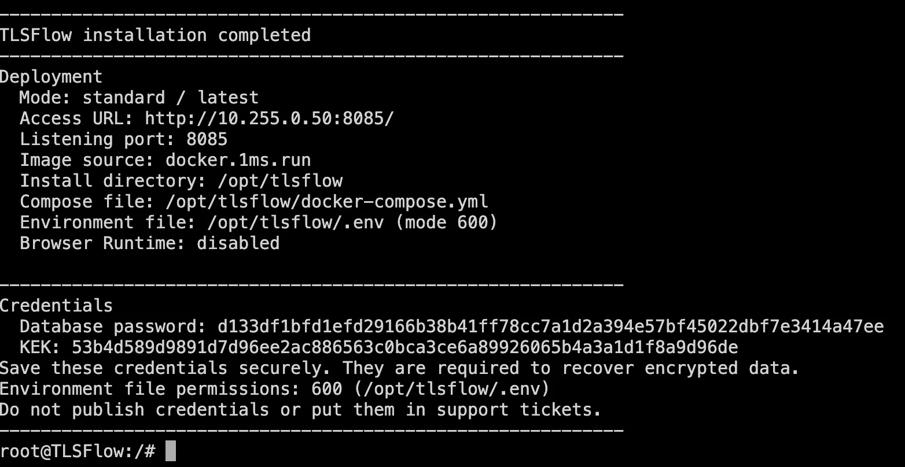
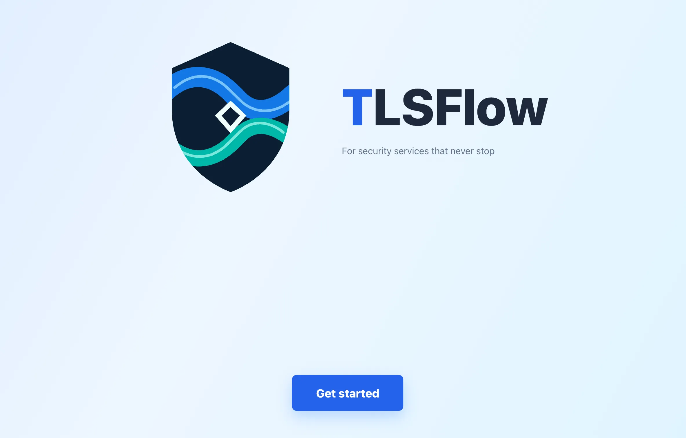

# Quick start

This page shows how to deploy TLSFlow for the first time with the official `install.sh` installer. The installer checks Docker, collects the deployment settings, selects an image source, and starts the required container or Compose project. The host does not need Node.js, Go, Buildx, or the TLSFlow source code.

The installer supports two deployment modes:

| Mode | Recommended for | Runtime | Data store |
| --- | --- | --- | --- |
| Single-node (small) | Evaluation, personal use, home NAS, or small environments | One `tlsflow-small` container | Built-in PGlite file database |
| Standard | Production, multi-tenant use, or continuous background tasks | Multiple Docker Compose services | Dedicated PostgreSQL |

The two modes cannot run at the same time and must not share a port or data directory. Standard mode is the usual production choice. Use single-node mode when you want to evaluate TLSFlow before moving to standard mode.

## 1. Prepare the host

Confirm the following on the deployment host:

- The operating system is Linux or macOS. Synology, QNAP, Unraid, and similar NAS systems are supported when they provide a working Docker environment.
- Docker CLI is installed and the Docker daemon is running.
- For standard mode, Docker Compose v2 is available; check with `docker compose version`.
- The host can reach the Docker registry and the devices, certificate services, and vendor APIs that you plan to connect.
- Port `8085` is available by default. You can choose another port during installation if needed.

The installer uses `/opt/tlsflow` by default. If the current user cannot write there, it falls back to `~/.tlsflow`. Set `TLSFLOW_INSTALL_DIR` to use another directory.

## 2. Download and run the installer

Copy the following command and run it in a terminal on the deployment host:

```bash
curl -fsSL https://www.tlsflow.com/install.sh | bash
```

The installer first asks for the interaction language, then collects the deployment mode, port, public URL, encryption key, and image source. Answers are read from the current terminal.


## 3. Complete the prompts

The prompts appear in this order:

1. **Language**: enter `1` for English or `2` for Simplified Chinese (default).
2. **Deployment mode**: enter `1` for single-node or `2` for standard (single-node is the default).
3. **Public listening port**: the default is `8085`. Enter an unused port if necessary.
4. **Public URL**: for example, `http://192.168.1.20:8085` or `https://tlsflow.example.com`. This must be reachable by your Agents and browsers.
5. **Encryption KEK**: enter one manually or let the installer generate it securely (recommended). The KEK must contain at least 16 characters and cannot contain spaces, quotes, `#`, or `=`.
6. **Standard-only settings**: enter the PostgreSQL `tlsflow` user password, or press Enter to generate one. Then choose whether to enable Browser Runtime.
7. **Image source**: choose Docker Hub, or probe and choose a reachable mainland China mirror. If Docker Hub is unreachable, the installer falls back automatically to an available mirror.
8. **Installation summary**: review the mode, port, URL, image source, and install directory, then enter `y` to start.

When installation finishes, the installer prints the access URL, install directory, container or Compose file path, the KEK, and (for standard mode) the database password. Save these credentials in a password manager immediately. They are required to recover encrypted data and must not be placed in screenshots, logs, or support tickets.

## 4. Single-node mode

Choose `1` at the deployment mode prompt. The installer will:

- pull `tlsflow/tlsflow-small:<version>`;
- create `tlsflow-small` and map the host port to the container's fixed port `3003`;
- store PGlite, workflows, runtime secrets, TLS Inspector data, and plugins under `data/` in the install directory;
- start the container with the `unless-stopped` restart policy.

Single-node mode does not require Docker Compose or a separate PostgreSQL service. It is intended for small deployments and does not provide a dedicated database, high availability, or Browser Runtime.

Open the access URL printed by the installer. You can also verify the container on the host:

```bash
docker ps --filter name=tlsflow-small
docker logs --tail 200 tlsflow-small
```

After the container is running, migrations have completed, and the console opens, continue with [First login](./first-login.md).


## 5. Standard mode

Choose `2` at the deployment mode prompt. The installer writes `.env` and `docker-compose.yml` in the install directory, then starts these Docker Compose services:

- `db`: PostgreSQL database;
- `backend`: TLSFlow API and background workers;
- `web`: TLSFlow Web console;
- `browser-runtime`: an isolated Chromium service, started only when Browser Runtime is enabled.

The installer creates `data/postgres`, `data/workflows`, `data/runtime`, `data/tls-inspector`, and `data/plugins`, validates the Compose configuration, pulls the images, and prepares the directory permissions before startup. Browser Runtime is disabled by default; enable it only when browser-based workflows require it.

After installation, verify the services using the paths printed by the installer:


```bash
docker compose \
  --project-name tlsflow \
  --file <install-directory>/docker-compose.yml \
  --env-file <install-directory>/.env \
  ps

docker compose \
  --project-name tlsflow \
  --file <install-directory>/docker-compose.yml \
  --env-file <install-directory>/.env \
  logs --tail 200 db backend web
```

Replace `<install-directory>` with the path from the installer output. Confirm that `db` is `healthy`, `backend` has completed migrations and is listening on `3003`, and `web` is running before opening the printed access URL.

## 6. After installation

1. Open the access URL printed by the installer and create the administrator account using [First login](./first-login.md).
2. Change the administrator password, create daily-use accounts, and assign roles according to least privilege.
3. Store device and vendor API credentials under **Settings > Credentials**, connect a test device, and run read-only discovery.
4. Import a test certificate and perform a small-scale test deployment. Confirm the execution record, target read-back, and audit log.
5. For production, back up `.env` and `data/`, especially `data/runtime/`. Never regenerate or replace a KEK that is already in use.

See [Deployment parameters](./deployment-parameters.md), [Single-node deployment](./single-node-deployment.md), and [Standard deployment](./standard-deployment.md) for the complete reference.

## Troubleshooting

- **Docker check fails**: start the Docker daemon and run the installer again. Standard mode also requires Docker Compose v2.
- **Port is already in use**: enter another port at the prompt and use the same port in the public URL.
- **An existing installation is detected**: the installer lists the containers and files it found and asks whether to delete them. Keeping the existing installation cancels this run. Delete only after confirming the target and taking a backup; cleaning data is a separate confirmation.
- **Image pull fails**: run the installer again and choose a reachable image source, or check the host's network path to the registry.
- **The page opens but the API is unavailable**: inspect `backend` and `web` logs for standard mode, or `docker logs tlsflow-small` for single-node mode. Do not expose the Browser Runtime address directly to the public network.
- **Switching modes**: stop and remove the existing architecture first, then confirm that the port and data directory are free before running the installer again. Never run single-node and standard mode together.
