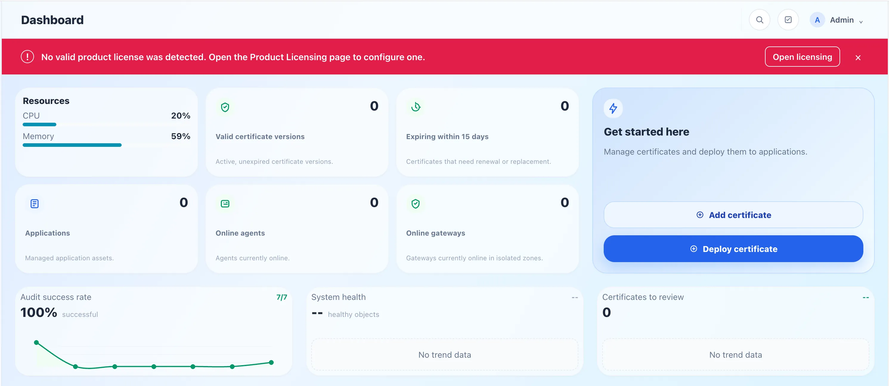

# License Request and Import

After initial setup, complete product licensing before normal use. When no valid license is installed, the console shows **No valid product license detected** and provides a link to the licensing page.

This guide covers the complete Community license flow: export a request from the current TLSFlow installation, generate a license in the TLSFlow User Center, and import the license back into the product.

The flow was checked against the [TLSFlow license center repository](https://git.jacksonz.cn:4443/jackson/license-generator.git), especially `public-platform/app.js`, `public-platform/dashboard.js`, `public-platform/licenses.js`, `src/routes/auth.mjs`, and `src/routes/licenses.mjs`.

> **File note:** The request file is generated by the TLSFlow installation, while the license file is generated by the TLSFlow User Center. They must refer to the same installation. Do not edit, truncate, or exchange them.

## Before You Start

- Make sure you can open the TLSFlow console and have permission to use **System Settings → Licensing**.
- Make sure you can receive verification codes and license files at the registration email address.
- Prepare an email address that has not already been used to activate another installation.

## Step 1: Export the Request File

The request file identifies the TLSFlow installation that will receive the license. Export it from the installation where you will use the license.

### From the Initial Setup Wizard

If you are still in the first-time setup wizard:

1. Open the **Product licensing** step.
2. Select **Export Request File**.
3. Save the downloaded JSON file without changing its content.

### From the Licensing Page

If setup is already complete:

1. Open **System Settings → Licensing**, or select **Go to licensing** in the no-license warning.
2. Select **Export Offline Request**.
3. Save the downloaded JSON file without changing its content.

The filename is usually similar to `tlsflow-activation-request-offline.json`. Keep this original file for the upload step.

## Step 2: Register and Sign In to the TLSFlow User Center

Open the [TLSFlow User Center](https://license.tlsflow.com). This is separate from the login page of the TLSFlow installation.

### Register a New Account

1. On the sign-in page, select **Create an account**. The page switches to the registration flow with **Email code** selected.
2. Enter your email address and select **Send code**.
3. Open the email, enter the verification code, and create a password of at least 8 characters.
4. Select **Complete registration** to enter the User Center.

### Sign In to an Existing Account

Choose one of these two paths:

1. **Password sign-in:** Enter the registered email address and password, then select **Sign in**.
2. **Email-code sign-in:** Switch to **Email code**, enter the email address, select **Send code**, enter the code from the email, and select **Verify and sign in**.

Verification codes are sent only to the entered email address. If a message does not arrive, check the spam folder and mail filtering rules, then request a new code.

After signing in, select **Request Community license** or open **Licenses** in the navigation.

The first account registered in the User Center becomes an administrator automatically. Later accounts are managed by an administrator in **Users**. Regular users do not need the administration center to request a Community license.

## Step 3: Generate a Community License

Regular users can request a Community license. The license is bound to the installation and device information in the request file.

1. On the **Licenses** page, confirm the heading **Request Community license**.
2. Select **Choose device information file** and upload the JSON file exported in Step 1. JSON files up to 1 MB are supported.
3. Wait for the file preview, then check that the filename and device information are correct.
4. Select **Generate Community license**.
5. Wait for the **License generated** confirmation.

Each account can keep only one active Community license. When requesting for a new installation, the User Center asks you to confirm re-application; confirming revokes the old license. The same device information cannot be submitted again, and a request file already activated by another account cannot be reused.

## Step 4: Download or Email the License File

After generation succeeds, find the new license in **My licenses**.

### Download the File

1. Select **Download license**.
2. Save the JSON file. The filename is usually `tlsflow-community-license.json`.
3. Keep the complete original file. Do not edit it in a text editor.

### Send the File by Email

1. Select **Email license**.
2. Wait for the confirmation that the file was sent.
3. Open the registration email and save the JSON attachment.

Both methods provide the same license. Keep at least one original copy so you can retry the import if needed.

## Step 5: Import the License into TLSFlow

Return to the TLSFlow installation that produced the request file and open **System Settings → Licensing**.

### Import from a File

1. Select **Import license file**. In the initial setup wizard, the equivalent button is **Import license file**.
2. Choose the complete JSON file downloaded in Step 4.
3. Wait for the import to finish and confirm that the license state is **Active** or that the page shows **Your license is active**.

### Import by Pasting JSON

If you cannot select a file directly:

1. Open the license JSON as text and copy its complete content.
2. Paste it into the license-content field on the Product licensing page.
3. Select **Import license**.
4. Confirm that the page shows the Community plan, an active state, and the expected validity and version compatibility.

Refresh the page and confirm that the no-license warning has disappeared. If import fails, do not edit the JSON. Download the license again and confirm that it was generated from the request file exported by this TLSFlow installation.

## Common Issues

### The User Center Rejects the Request File

Confirm that you uploaded the original JSON exported by TLSFlow, not a screenshot, a copied fragment, or a request from another installation. The file must be no larger than 1 MB.

### You Cannot Request Another License

Regular users can keep only one active Community license. To request for a new installation, confirm the re-application prompt; the old license will be revoked. The same device information cannot be reused.

### TLSFlow Says the License Does Not Match

The license may belong to another installation, or its content may have been changed. Export a new request from the current installation and generate a new Community license in the User Center.

### The Verification Code or License Email Does Not Arrive

Check the email address, spam folder, and mail filtering rules. You can request a new code or use **Download license** in **My licenses** instead of waiting for the email.

### The License File Was Not Saved

Sign in to the User Center, open **Licenses → My licenses**, and select **Download license** or **Email license** for the active license.
