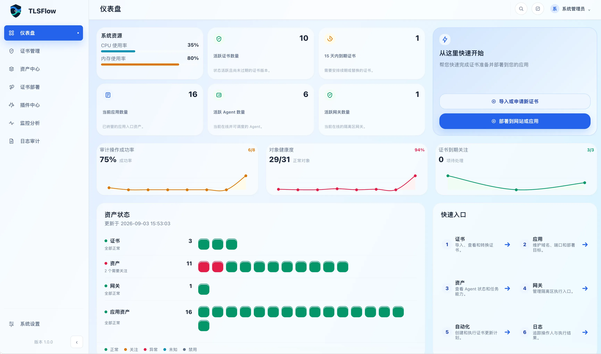
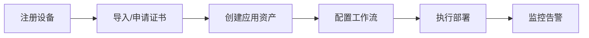

# TLSFlow v1.0.0 官方文档

欢迎使用 TLSFlow！这是一款企业级证书生命周期管理平台，帮助你统一管理证书的申请、部署、更新和监控，让证书管理从手工操作变为自动化执行，从事后补救变为主动监控。

---

## 核心能力

**🔐 证书自动化管理**  
从 Let's Encrypt、ZeroSSL 等 CA 自动申请证书，统一存储、续期和版本管理

**🔄 可视化工作流**  
拖拽式配置部署流程，支持 SSH 执行、HTTP API 调用、条件分支和异常处理

**🔌 插件化扩展**  
内置 Nginx、Apache、Tomcat、IIS 等插件，支持自定义开发新平台适配

**📊 监控与审计**  
证书到期前自动告警，所有操作全程记录，支持一键回滚

---

## 文档导航

### 📦 [安装部署](/v1.0.0/installation/)

从零开始部署 TLSFlow，选择适合你的部署方式：

- **[快速开始](/v1.0.0/installation/quick-start)** - 5 分钟快速体验
- **[标准部署](/v1.0.0/installation/standard-deployment)** - 前后端分离 + PostgreSQL，适合生产环境
- **[单机部署](/v1.0.0/installation/single-node-deployment)** - 一键 Docker Compose 启动，适合测试体验
- **[部署参数](/v1.0.0/installation/deployment-parameters)** - 环境变量和配置项说明
- **[首次登录](/v1.0.0/installation/first-login)** - 完成初始化配置

### 📚 [用户手册](/v1.0.0/manual/)

按控制台菜单结构组织的完整操作指南，涵盖从证书申请到部署执行的全流程：

**核心模块**
- **[仪表盘](/v1.0.0/manual/dashboard)** - 证书状态概览和快速操作入口
- **[证书管理](/v1.0.0/manual/certificate-management)** - 证书资产、ACME 自动化、CA 配置
- **[资产中心](/v1.0.0/manual/asset-center)** - 应用资产、设备、云账号、Gateway
- **[证书部署](/v1.0.0/manual/certificate-deployment)** - 工作流配置、自动化执行、执行记录
- **[插件中心](/v1.0.0/manual/plugin-center)** - 插件安装、配置和管理

**运维管理**
- **[监控分析](/v1.0.0/manual/monitoring)** - 证书到期监控、部署成功率、报表
- **[日志审计](/v1.0.0/manual/audit-logs)** - 操作记录、合规审计
- **[系统设置](/v1.0.0/manual/system-settings)** - 用户、角色、凭据、通知、许可证

**进阶主题**
- **[租户与 RBAC](/v1.0.0/manual/tenant-and-rbac)** - 多租户隔离和权限控制
- **[Agent](/v1.0.0/manual/Agent)** - 远程执行代理配置
- **[备份与恢复](/v1.0.0/manual/backup-and-restore)** - 数据备份策略
- **[升级与回滚](/v1.0.0/manual/upgrade-and-rollback)** - 版本升级指南
- **[故障排查](/v1.0.0/manual/troubleshooting)** - 常见问题诊断
- **[安全注意事项](/v1.0.0/manual/security-considerations)** - 安全加固建议

### 🛠️ [开发文档](/v1.0.0/developer/)

扩展 TLSFlow 功能，开发自定义插件和工作流：

- **[宿主插件能力清单](/v1.0.0/developer/host-plugin-capabilities)** - 平台提供的插件开发接口
- **[插件开发](/v1.0.0/developer/plugin-development)** - 插件开发规范和最佳实践
- **[插件示例：Nginx Proxy Manager](/v1.0.0/developer/plugin-example-nginx-proxy-manager)** - 完整插件开发案例
- **[工作流开发规范](/v1.0.0/developer/workflow-development)** - 工作流模板开发指南

---

## 快速开始

### 典型使用流程

### 5 分钟快速体验

1. **部署安装** - 执行单机部署，一键启动 TLSFlow
2. **首次登录** - 访问控制台，完成初始化
3. **跟随引导** - 在仪表盘点击"快速开始"，按向导完成首次证书部署

→ [查看详细快速开始指南](/v1.0.0/installation/quick-start)

---

## 其他语言版本

- 🇺🇸 [English Documentation](/v1.0.0/en/)

---

## 技术支持

如有疑问或需要帮助：

- 📖 **文档搜索** - 使用顶部搜索框查找相关内容
- 📧 **邮件支持** - support@tlsflow.com
- 🐛 **问题反馈** - [GitHub Issues](https://github.com/your-org/tlsflow/issues)

---

**当前版本**：TLSFlow v1.0.0 | **文档更新**：2026-08-22

文档内容以现行 Spec、代码和验证证据为准。

