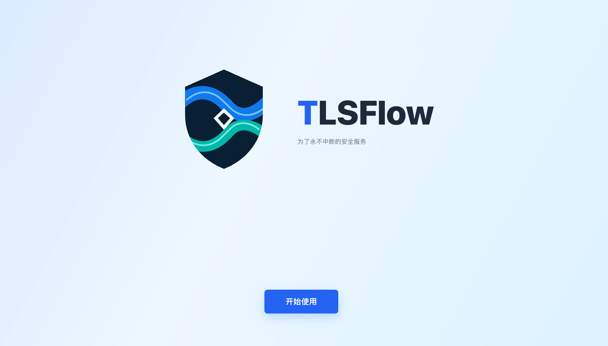
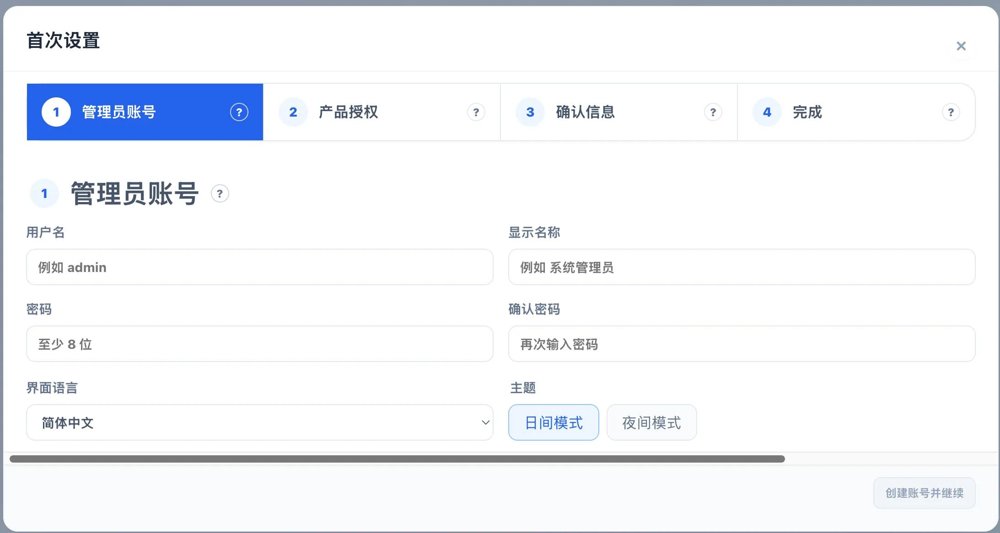
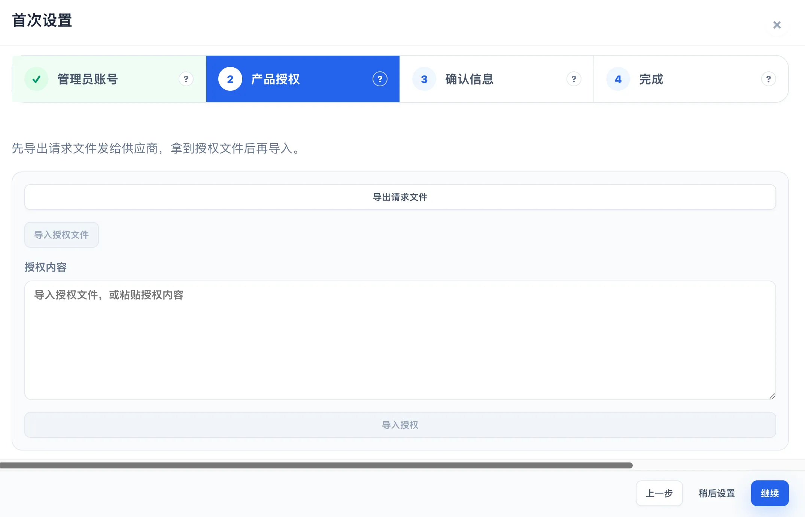
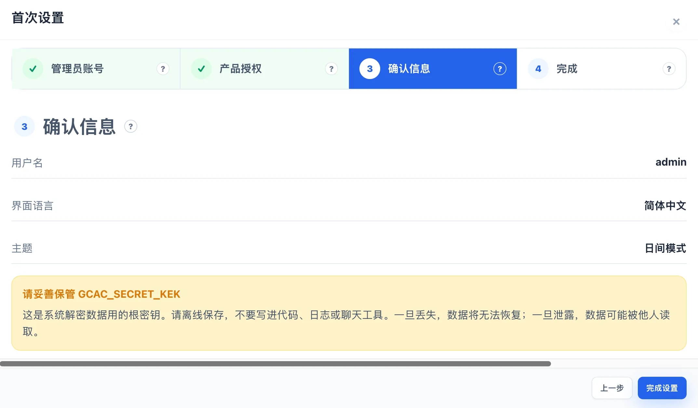

# 首次登录

部署完成后，第一次访问控制台会进入“首次设置”向导。跟着页面走一遍即可完成所有的初始化工作。

本文描述的是全新实例的首次使用。如果打开后直接看到普通登录页，说明系统已经完成初始化，请直接使用已有账号登录。

## 打开控制台

- 标准部署：打开 `http://<主机地址>:<GCAC_PORT>/`，默认端口是 `8085`。
- 单机部署：打开 `http://<主机地址>:8085/`；如果通过 `docker run -p` 修改了宿主机端口，请使用实际映射的端口。

确保容器已经启动、浏览器能访问 Web 页面。首次访问时，系统会自动把你带到初始化界面；不需要手动拼接初始化地址。

## 跟着“首次设置”向导完成初始化

### 1. 进入设置

页面会先播放一段简短的品牌开场动画。动画结束后点击“开始使用”即可进入向导。开启了系统的“减少动态效果”时，动画会直接跳过，不影响后续操作。

### 2. 创建管理员账号

在“管理员账号”这一步填写：

- **用户名**：以后登录时使用，建议使用容易辨认且不会与他人混淆的名称。支持 2 到 64 位字母、数字、点、下划线和短横线，且必须以字母或数字开头。
- **显示名称**：显示在系统界面中的称呼，例如“系统管理员”。
- **密码**和**确认密码**：密码至少 8 位，并确保两次输入一致。
- **界面语言**和**主题**：按当前使用习惯选择，之后仍可在系统偏好中调整。

点击“创建账号并继续”。账号创建成功后，系统会自动保存初始化状态并暂时建立登录会话，然后进入下一步。密码不会被带到后续页面，也不会显示在确认页。

### 3. 设置产品授权（可选）

如果现在还没有授权文件，可以点击“稍后设置”跳过，这不会阻止完成初始化，之后可在“产品授权”页面补充。

如果要在此处完成离线授权：

1. 点击“导出请求文件”，保存下载的 JSON 文件，并按供应商要求发送。
2. 收到授权响应后，点击“导入授权文件”选择 JSON 文件，或将完整内容粘贴到“授权内容”文本框。
3. 点击“导入授权”，看到“授权已生效”后再继续。

请求文件和授权文件是配对的。请保留原始文件，导入失败时先确认没有截断内容、改动格式，且响应文件确实对应这台实例。

### 4. 核对并完成设置

“确认信息”页会显示用户名、界面语言和主题，供你做最后检查；密码不会显示。

页面还会提醒你保管 `GCAC_SECRET_KEK`。这是用于解密系统敏感数据的根密钥：请把它离线保存，不要放进代码、日志、截图或聊天工具。密钥丢失后，历史 Secret 数据无法恢复；初始化后也不要随意更换该值。

确认无误后点击“完成设置”。看到“设置完成”后，点击“去登录”。

## 用新账号正式登录

在登录页输入刚才创建的用户名和密码，点击“登录”。向导最后会主动回到登录页，这是正常流程，用于让你验证新账号确实可以独立登录。

登录后可以先做三件事：

1. 在用户和角色设置中创建日常使用账号，管理员账号只用于管理操作。
2. 在“系统设置 → 凭据”中录入需要连接设备或服务的凭据。
3. 在资产中心接入一个测试目标，再用测试证书执行一次小范围测试部署，并检查执行记录和目标回读。

## 常见情况

### 页面一直停在初始化界面

先确认 Backend 和数据库已经就绪，再刷新页面。初始化提交失败时，向导会回到可重试状态，不会留下半个管理员账号。

### 提示“两次输入的密码不一样”

重新输入“密码”和“确认密码”，注意不要带入首尾空格。

### 授权导入失败

确认已经先导出本机的请求文件，再导入供应商返回的完整 JSON。授权可以稍后在“产品授权”页面处理，不必为了继续初始化反复重试。

### 忘记了 `GCAC_SECRET_KEK`

不要通过更换环境变量来“找回”数据。该密钥用于解密历史 Secret，丢失后只能按组织的密钥恢复流程处理；部署时应从密码管理器或离线保管位置找回原值。

## 初始化后的重要工作：导入产品授权

完成初始化后，请先导入产品授权，再开始日常使用。如果控制台显示“未检测到有效产品授权”，请打开“系统设置 → 授权管理”并完成授权流程：从本机导出申请文件，注册或登录 [TLSFlow 用户中心](https://license.tlsflow.com)，生成社区版授权，下载授权文件或发送到邮箱，最后将完整 JSON 文件导入授权管理页面。申请文件和授权文件与本次安装绑定，请勿编辑文件内容。
