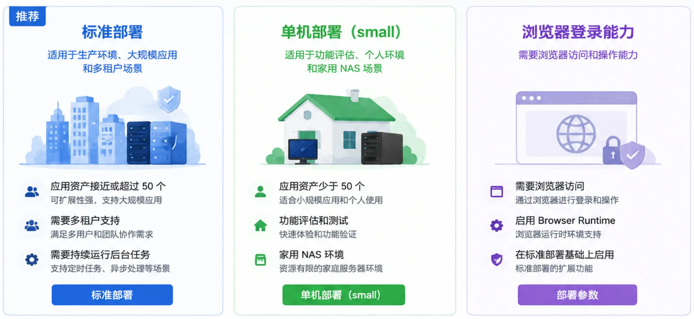

<h1>安装部署</h1>

本页帮助你完成 TLSFlow v1.0.0 的首次部署。TLSFlow 提供两种 Docker 部署方式：

<ul>
  <li><strong>标准部署</strong>适合生产环境，使用 Docker Compose 运行多个服务，并使用 PostgreSQL 保存业务数据。</li>
  <li><strong>单机部署（small）</strong>适合评估、小规模使用或家用 NAS，使用一个 Docker 容器和内置的文件型数据库。</li>
</ul>

两种方式都使用 Docker Hub 上的预构建镜像。部署主机不需要安装 Node.js、Go 或 TLSFlow 源码。

## 先选择部署方式

| 如果你的情况是 | 推荐方式 | 你需要准备 | 详细说明 |
| --- | --- | --- | --- |
| 用于生产环境，应用资产接近或超过 50 个，需要多租户或持续运行后台任务 | **标准部署** | Docker Compose v2、持久化目录、PostgreSQL 配置和平台密钥 | [标准部署](./standard-deployment.md) |
| 用于功能评估、个人环境、家用 NAS，且应用资产少于 50 个 | **单机部署（small）** | Docker CLI、持久化目录和平台密钥 | [单机部署](./single-node-deployment.md) |
| 需要浏览器登录能力 | **标准部署** | 在标准部署基础上按需启用 Browser Runtime（浏览器运行时） | [部署参数](./deployment-parameters.md) |

> **注意**：标准部署和单机部署不能同时运行。切换方式前，请先停止原有容器，并确认没有继续占用 `8085` 端口或使用同一组数据目录。

## 推荐的安装顺序

无论选择哪种方式，都按下面的顺序操作：

1. 阅读[快速开始](./quick-start.md)，确认主机条件、镜像来源和必填密钥。
2. 根据上表进入[标准部署](./standard-deployment.md)或[单机部署](./single-node-deployment.md)，启动对应容器。
3. 参考[部署参数](./deployment-parameters.md)检查环境变量；密钥类变量在首次初始化后必须保持不变。
4. 打开[首次登录](./first-login.md)，创建管理员账号并完成安全初始化。
5. 登录后确认许可证状态（如有许可证），再创建日常账号、录入凭据、接入测试设备，最后导入测试证书并执行一次小范围测试部署，检查执行记录和目标回读。

这个顺序可以把问题分成几类逐步确认：主机和容器是否正常、账号和权限是否正确、目标设备是否可连接，以及证书部署是否真正完成。

## 安装完成后你应该确认

- 容器状态为 `running`，数据库迁移已完成，Web 页面可以打开。
- 管理员账号已创建，日常操作使用单独账号，权限遵循最小授权原则。
- 生产环境已配置持久化目录，并已备份数据库、工作流和运行时安全材料。
- 测试设备可以完成连接和只读发现，测试证书可以完成小范围测试部署，并能在执行记录中看到目标回读结果。
- 需要确认的结果以执行记录、目标回读、监控和审计日志为准；页面提交成功不等于证书已经部署成功。

## 相关文档

- [快速开始](./quick-start.md)：从准备文件到启动容器的最短路径。
- [部署参数](./deployment-parameters.md)：环境变量、密钥和数据目录的完整说明。
- [首次登录](./first-login.md)：初始化管理员账号并完成首次安全设置。
