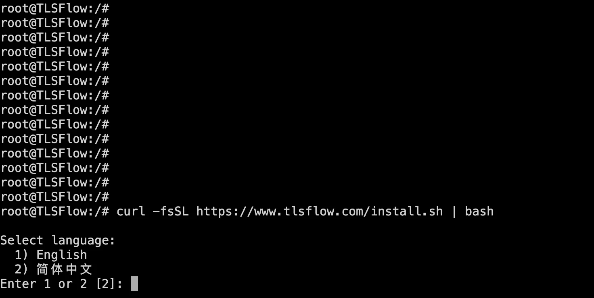
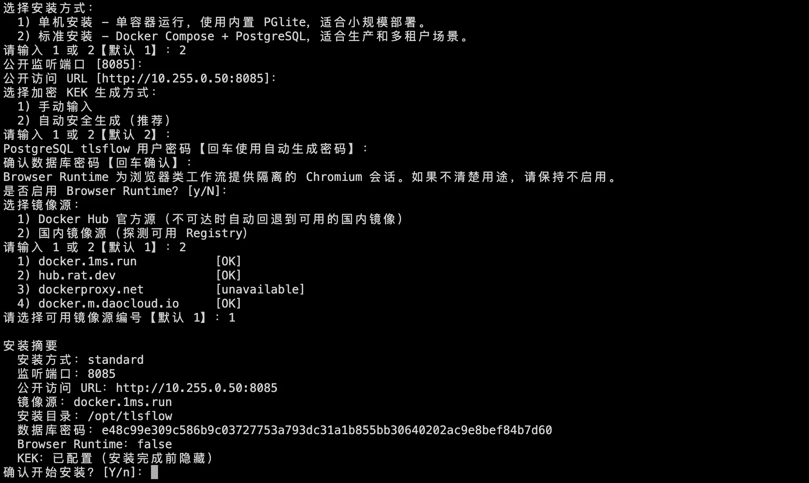
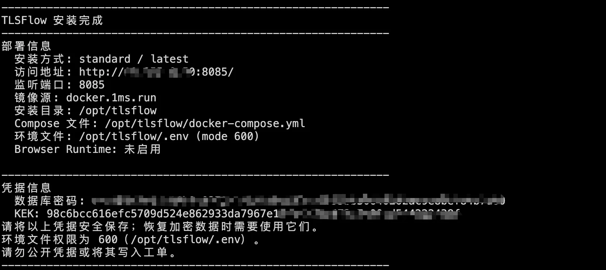
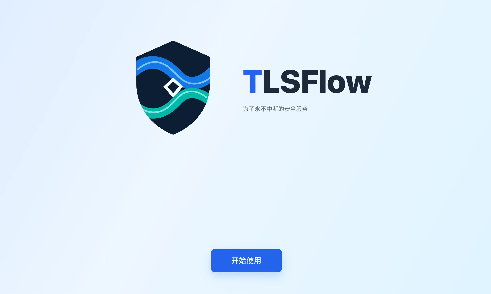

# 快速开始

本页介绍如何使用 TLSFlow 官方一键安装脚本 `install.sh` 完成首次部署。脚本会检查 Docker 环境、引导你填写部署参数、选择镜像源，并自动启动对应的容器。部署主机不需要安装 Node.js、Go、Buildx 或 TLSFlow 源码。

脚本支持两种安装方式：

| 安装方式 | 适用场景 | 运行方式 | 数据存储 |
| --- | --- | --- | --- |
| 单机安装（small） | 评估、个人环境、家用 NAS 或小规模使用 | 一个 `tlsflow-small` 容器 | 内置 PGlite 文件型数据库 |
| 标准安装（standard） | 生产环境、多租户或持续运行的后台任务 | Docker Compose 多服务 | 独立 PostgreSQL |

两种方式不能同时运行，也不能共用同一个端口或数据目录。生产环境通常应选择标准安装；不确定时可先使用单机安装评估，再迁移到标准安装。

## 1. 准备主机

在部署主机上确认：

- 操作系统为 Linux 或 macOS；群晖、威联通、Unraid 等 NAS 只要提供可用的 Docker 环境也可以使用。
- 已安装 Docker CLI，并且 Docker daemon（Docker 后台服务）正在运行。
- 选择标准安装时，Docker Compose v2 可用，可执行 `docker compose version` 检查。
- 主机可以访问 Docker 镜像仓库，以及后续要接入的设备、证书服务和厂商 API。
- 默认监听端口为 `8085`。如果该端口已被占用，安装时可以改用其他端口。

脚本默认将文件写入 `/opt/tlsflow`。如果当前用户没有该目录的写入权限，脚本会自动改用 `~/.tlsflow`；也可以通过 `TLSFLOW_INSTALL_DIR` 指定其他目录。

## 2. 获取并运行安装脚本

复制下面的命令，在部署主机的终端中执行：

```bash
curl -fsSL https://www.tlsflow.com/install.sh | bash
```

脚本会先让你选择交互语言，然后依次收集安装方式、端口、公开访问 URL、加密密钥和镜像源。回答会从当前终端读取。



## 3. 按提示完成配置

脚本中的提示按以下顺序出现：

1. **语言**：输入 `1` 使用 English，输入 `2` 使用简体中文（默认）。
2. **安装方式**：输入 `1` 选择单机安装，输入 `2` 选择标准安装（默认单机）。
3. **公开监听端口**：默认 `8085`。如果端口冲突，请输入一个未被占用的端口。
4. **公开访问 URL**：例如 `http://192.168.1.20:8085` 或 `https://tlsflow.example.com`。该地址必须是 Agent 和浏览器实际能够访问的地址。
5. **加密 KEK**：可以手动输入，也可以选择自动安全生成（推荐）。KEK 至少 16 个字符，不能包含空格、引号、`#` 或 `=`。
6. **标准安装专属配置**：输入 PostgreSQL `tlsflow` 用户密码，或按回车让脚本生成；然后选择是否启用 Browser Runtime。
7. **镜像源**：选择 Docker Hub，或探测并选择可用的国内镜像源。Docker Hub 不可达时，脚本会自动回退到可用镜像。
8. **安装摘要**：确认安装方式、端口、访问地址、镜像源和安装目录后，输入 `y` 开始安装。

安装完成后，脚本会打印访问地址、安装目录、容器或 Compose 文件位置，以及 KEK 和（标准安装的）数据库密码。请立即将这些凭据保存到密码管理器；它们用于恢复加密数据，不能写入截图、日志或工单。

## 4. 单机安装（small）

在“安装方式”提示中选择 `1`。脚本会执行以下操作：

- 拉取 `tlsflow/tlsflow-small:<版本>` 镜像；
- 创建 `tlsflow-small` 容器，并将宿主机端口映射到容器的 `3003` 端口；
- 在安装目录的 `data/` 下保存 PGlite、工作流、运行时密钥、TLS Inspector 和插件数据；
- 以 `unless-stopped` 策略启动容器。

单机安装不需要 Docker Compose 或单独的 PostgreSQL，适合小规模使用。它不提供独立数据库、高可用或 Browser Runtime。

安装完成后，使用脚本输出的访问地址打开控制台。也可以在部署主机上验证：

```bash
docker ps --filter name=tlsflow-small
docker logs --tail 200 tlsflow-small
```

确认容器处于运行状态、迁移已完成且页面可以打开后，继续阅读[首次登录](./first-login.md)。


## 5. 标准安装（standard）

在“安装方式”提示中选择 `2`。脚本会在安装目录生成 `.env` 和 `docker-compose.yml`，然后使用 Docker Compose 启动以下服务：

- `db`：PostgreSQL 数据库；
- `backend`：TLSFlow API 和后台任务；
- `web`：TLSFlow Web 控制台；
- `browser-runtime`：可选的隔离 Chromium 服务，仅在启用 Browser Runtime 时启动。

脚本会自动创建 `data/postgres`、`data/workflows`、`data/runtime`、`data/tls-inspector` 和 `data/plugins` 目录，并在启动前检查 Compose 配置、拉取镜像和初始化目录权限。Browser Runtime 默认关闭；只有明确需要浏览器类工作流时才启用。

安装完成后，使用脚本输出的 Compose 文件路径验证服务：

```bash
docker compose \
  --project-name tlsflow \
  --file <安装目录>/docker-compose.yml \
  --env-file <安装目录>/.env \
  ps

docker compose \
  --project-name tlsflow \
  --file <安装目录>/docker-compose.yml \
  --env-file <安装目录>/.env \
  logs --tail 200 db backend web
```

将 `<安装目录>` 替换为脚本结果中的实际路径。确认 `db` 为 `healthy`、`backend` 已完成迁移并监听 `3003`、`web` 处于运行状态后，再打开脚本输出的访问地址。

## 6. 安装完成后


1. 打开脚本输出的访问地址，按[首次登录](./first-login.md)中的向导创建管理员账号。
2. 登录后修改管理员密码，创建日常使用账号，并按最小权限原则分配角色。
3. 在“系统设置 → 凭据”保存设备和厂商 API 凭据，再接入一个测试设备执行只读发现。
4. 导入测试证书并执行一次小范围测试部署，确认执行记录、目标回读和审计日志均正常。
5. 生产环境请备份安装目录下的 `.env` 和 `data/`，尤其是 `data/runtime/`；不要重新生成或替换已经使用过的 KEK。

更完整的参数说明请参阅[部署参数](./deployment-parameters.md)、[单机部署](./single-node-deployment.md)和[标准部署](./standard-deployment.md)。

## 常见问题

- **Docker 检查失败**：启动 Docker daemon 后重新运行脚本。标准安装还需安装 Docker Compose v2。
- **端口已占用**：在端口提示中输入其他端口，并确保公开访问 URL 使用相同端口。
- **已有安装被检测到**：脚本会显示已发现的容器和文件，并询问是否删除。选择保留时本次安装会取消；只有确认目标和备份后，才选择删除。清理数据是单独的确认步骤。
- **镜像拉取失败**：重新运行脚本并选择可达的镜像源，或先检查主机到 Registry 的网络连接。
- **页面能打开但 API 不可用**：标准安装检查 `backend` 和 `web` 日志；单机安装检查 `docker logs tlsflow-small`。不要把 Browser Runtime 地址直接暴露到公网。
- **切换安装方式**：先停止并删除原架构容器，确认端口和数据目录不再使用，再重新运行脚本。不要让单机和标准安装同时运行。
