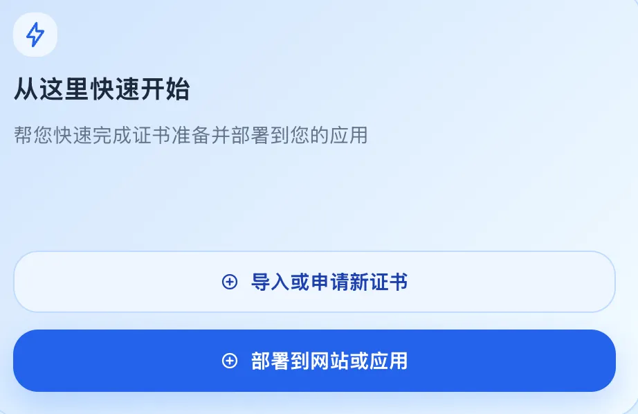

# 快速开始

> **初始化完成后的重要工作：导入产品授权**：如果页面顶部出现“未检测到有效产品授权，请前往产品授权页面完成配置”，请先按[授权申请与导入](./license-request-and-import.md)完成授权，再开始证书和应用配置。

仪表盘的“从这里快速开始”区域就是首次证书部署的推荐入口。最基本的配置只有两个动作：先准备证书，再创建应用并生成更新计划。

## 第一步：导入或创建证书

在仪表盘点击“导入或申请新证书”，根据手上的证书材料选择下面一种方式。

### 已经有签发好的证书：导入证书

1. 选择“导入已有证书”。
2. 如果材料是 PEM 文件或文本，分别提供服务器证书、完整中间证书链和匹配的私钥。
3. 如果材料是 PFX/PKCS#12 文件，上传 `.pfx` 或 `.p12` 文件并填写文件密码。
4. 按页面提示校验材料，确认域名覆盖实际访问域名、证书未过期且私钥匹配。

### 还没有证书：通过 ACME 申请

1. 选择 ACME 申请方式。
2. 选择已配置的 ACME 账号和申请配置，填写域名及验证方式。
3. 按页面提示完成域名验证，等待证书签发。
4. 在证书版本详情中确认新版本状态为可用。

### 证书准备完成

无论选择哪种方式，都要确认新版本可以在应用向导的“证书”下拉框中选到，再继续第二步。这表示证书已经准备好。

## 第二步：创建应用和更新计划

回到仪表盘点击“部署到网站或应用”，按向导完成以下选择。

这个向导一定会创建一个应用；如果选择已有证书版本，还会同时创建一个更新计划。

### 选择业务平台

选择实际运行网站、网关或服务的平台。找不到对应平台时，到插件中心确认是否已安装并启用相应平台支持。

### 选择已有资产

如果目标设备或服务已经接入平台：

1. 选择“使用已有设备”或已有服务资产。
2. 选择后点击“继续”，等待连接测试和站点发现完成。
3. 从发现结果中选择要更新的站点。

### 新增设备或服务

如果目标还没有接入平台：

1. 选择“新增设备”。
2. 按统一设备接入向导完成注册或连接配置。
3. 返回应用接入向导，继续连接测试、站点发现和目标选择。

### 填写站点信息

选中站点后，填写用户访问时使用的 DNS 域名和验证 URL。两个地址应使用同一个业务域名；目标平台要求额外的证书格式、凭据或部署参数时，按页面提示填写。

### 使用第一步准备好的证书

如果要部署已经准备好的证书：

1. 选择“手动选择证书”。
2. 选择第一步导入或申请的证书资产。
3. 选择要部署的证书版本；只做本次更新时选择具体版本，后续始终跟随新版本时选择“始终使用最新版本”。

### 为应用单独申请 ACME 证书

如果每个应用都要使用独立证书：

1. 选择“选择专属证书”。
2. 选择“ACME”作为签发方式。
3. 按页面提示选择 ACME 账号、申请配置和域名验证方式。
4. 补充页面要求的签发参数。此方式适合需要独立续期的应用；只做首次更新时，优先使用上面的“手动选择证书”。

### 设置后续更新方式

#### 只更新这一次

选择“暂不设置”。应用创建后，需要更新时再手动执行计划。

#### 证书有新版本时自动更新

选择“证书产生新版本时自动更新”。

- 选择“立即执行”，新版本产生后马上创建更新任务。
- 选择“按指定时间执行”，再填写每天执行的时间。

#### 按固定周期更新

选择“按固定周期自动更新”，再选择下面一种频率：

- 每天：填写每天的执行时间。
- 每周：选择星期几并填写执行时间。
- 每月：选择日期并填写执行时间。

### 确认创建

在完成页核对平台、资产、站点和证书信息，点击“确认并创建”。使用“手动选择证书”时，系统会同时创建应用和更新计划；使用“选择专属证书”时，先创建应用并保存证书申请配置。

“确认并创建”只保存应用和计划配置，不会立即修改目标服务。要真正更新证书，还要在创建完成后提交并执行计划，并在执行记录中确认目标回读结果。

## 创建后执行更新

应用和计划创建完成后，打开“证书部署”或应用详情中的计划入口：

1. 检查计划页面显示的连接、凭据、证书格式和目标配置，按页面提示补齐缺少的信息。
2. 提交并执行计划；启用审批的租户还要等待审批通过。
3. 打开执行记录，确认安装、服务刷新和目标回读都成功，并核对回读指纹与第二步选择的证书版本一致。

## 入口不可用或没有目标

- 没有“导入或申请新证书”：检查当前租户是否允许创建证书，或联系管理员。
- 没有“部署到网站或应用”：请管理员确认当前账号具备应用管理权限，并先完成第一步证书准备。
- 资产或站点列表为空：到“资产中心”确认设备/服务在线，运行连接测试和发现后再返回向导。
- 没有匹配的证书版本：检查证书域名是否覆盖应用访问域名，或返回第一步补充正确版本。
- 提交或执行失败：打开页面提示和执行记录，按错误信息补充连接、凭据、证书格式或目标配置后重新提交。
