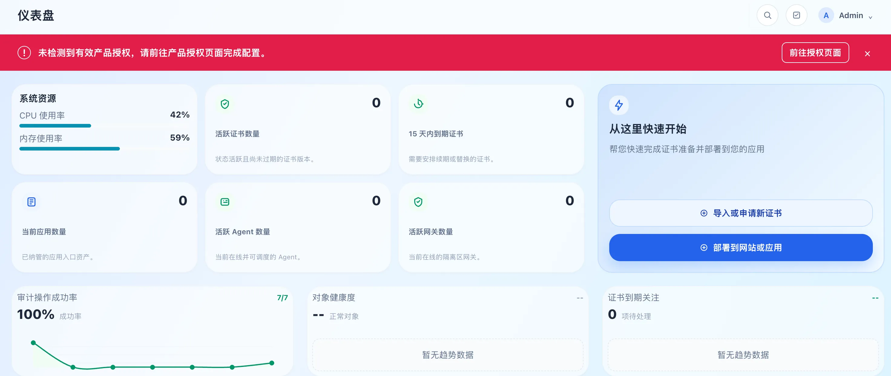

# 授权申请与导入

首次初始化完成后，建议先完成产品授权。未导入有效授权时，控制台顶部会显示“未检测到有效产品授权，请前往产品授权页面完成配置”，并提供“前往授权页面”入口。

本文说明社区版授权的完整操作：从当前 TLSFlow 实例导出申请文件，到 TLSFlow 用户中心生成授权，再把授权导回产品。

> **文件说明**：申请文件由当前 TLSFlow 实例生成，授权文件由 TLSFlow 用户中心生成。两份文件必须对应同一实例，不能互换、修改或截断内容。

## 操作前准备

- 可以打开当前 TLSFlow 控制台，并拥有“系统设置 → 产品授权”的管理权限。
- 可以接收注册邮箱的验证码和授权文件邮件。
- 准备一个尚未用于其他账号或其他实例授权的邮箱账号。

## 第一步：导出申请文件

申请文件用于说明“要为哪一个 TLSFlow 实例生成授权”。必须在要使用授权的那台实例上导出。

### 从初始化向导导出

如果还停留在首次设置向导：

1. 进入“产品授权”步骤。
2. 点击“导出请求文件”。
3. 保存下载的 JSON 文件，不要修改文件内容。

### 从产品授权页面导出

如果已经完成初始化：

1. 打开“系统设置 → 产品授权”，也可以点击顶部警告中的“前往授权页面”。
2. 点击“导出离线请求”。
3. 保存下载的 JSON 文件，不要修改文件内容。

建议将文件暂存在受控位置，文件名通常类似 `tlsflow-activation-request-offline.json`。后续上传时选择这份原始文件。

## 第二步：注册并登录 TLSFlow 用户中心

打开 [TLSFlow 用户中心](https://license.tlsflow.com)。授权申请和下载在用户中心完成，与当前 TLSFlow 实例的登录账号不是同一个登录页面。

### 首次注册

1. 在登录页点击“注册账号”，页面会切换到注册模式和“邮箱验证码”步骤。
2. 输入邮箱地址，点击“发送验证码”。
3. 打开邮箱，输入收到的验证码，并设置至少 8 位的登录密码。
4. 点击“完成注册”，进入用户中心。

### 已有账号登录

有两种登录方式，请选择其中一种：

1. **密码登录**：输入注册邮箱和密码，点击“登录”。
2. **邮箱验证码登录**：切换到“邮箱验证码”，输入邮箱并发送验证码，再输入邮件中的验证码，点击“验证并登录”。

验证码只发送到当前填写的邮箱。收不到邮件时，检查垃圾邮件、邮箱地址和邮件服务状态，再重新发送验证码。

登录成功后进入用户中心首页。点击“申请社区版授权”或左侧的“授权管理”进入授权申请页面。

用户中心的第一个注册账号会自动成为管理员；后续账号由管理员在“用户管理”中维护。普通账号不需要进入管理中心，按本文申请社区版授权即可。

## 第三步：生成社区版授权

普通用户申请的是社区版授权。社区版授权绑定申请文件中的安装实例和设备信息。

1. 在“授权管理”页面确认标题为“申请社区版授权”。
2. 点击“选择设备信息文件”，上传第一步导出的 JSON 文件。页面支持 JSON 文件，大小不能超过 1 MB。
3. 等待页面解析文件，检查预览中的设备信息和文件名是否正确。
4. 点击“生成社区版授权”。
5. 等待页面提示“授权生成成功”。

每个账号只能保留一个有效的社区版授权。申请新设备时，如果账号已有有效社区版授权，页面会要求确认重新申请；确认后旧授权会被撤销。相同设备信息不能重复申请，也不能使用已经被其他账号激活过的申请文件。

## 第四步：下载或发送授权文件

授权生成成功后，在“我的授权”列表中找到刚生成的社区版授权。

### 下载到本机

1. 点击“下载授权”。
2. 保存下载的 JSON 文件，文件名通常为 `tlsflow-community-license.json`。
3. 保留完整文件，不要用文本编辑器修改内容。

### 发送到注册邮箱

1. 点击“发送到邮箱”。
2. 等待页面提示授权文件已发送。
3. 在注册邮箱中下载附件或按照邮件提供的方式保存 JSON 文件。

下载和发送都可以使用。建议至少保留一份原始授权文件，便于导入失败时重新尝试。

## 第五步：在 TLSFlow 中导入授权

返回生成申请文件的那一个 TLSFlow 实例，打开“系统设置 → 产品授权”。

### 通过文件导入

1. 点击“导入许可证”。初始化向导中对应的按钮名称是“导入授权文件”。
2. 选择第四步下载的完整 JSON 文件。
3. 等待页面完成导入，看到“授权已生效”或授权状态变为有效。

### 通过粘贴内容导入

如果无法直接选择文件：

1. 用文本方式打开授权 JSON，完整复制文件内容。
2. 粘贴到产品授权页面的授权内容输入框。
3. 点击“导入许可证”。
4. 确认页面显示有效授权、社区版套餐和对应的有效期/版本兼容信息。

导入后刷新页面，确认顶部未授权警告已经消失。若导入失败，不要手工修改 JSON；重新下载授权文件，并确认它由同一份申请文件生成且对应当前 TLSFlow 实例。

## 常见问题

### 用户中心提示申请文件无效

确认上传的是 TLSFlow 导出的原始 JSON 文件，而不是截图、复制后的片段或其他实例的申请文件。文件大小不能超过 1 MB。

### 生成授权后无法再次申请

普通用户只能保留一个有效社区版授权。使用新实例申请前，需要在确认提示中确认重新申请；旧授权会被撤销。相同设备信息不能重复申请。

### TLSFlow 提示授权不匹配

通常是授权文件与当前实例不对应，或文件内容被改动。回到当前实例重新导出申请文件，再回到用户中心重新生成社区版授权。

### 收不到验证码或授权邮件

确认填写的邮箱地址正确，检查垃圾邮件和邮箱拦截规则；仍未收到时，稍后重新发送验证码或在“我的授权”中使用“下载授权”。

### 忘记保存授权文件

登录用户中心，打开“授权管理 → 我的授权”，对有效授权再次点击“下载授权”或“发送到邮箱”。
